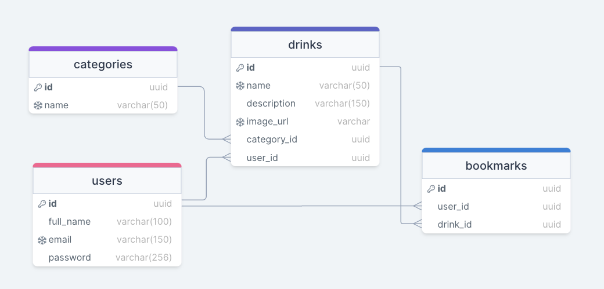

# DrinkHub API
This API is built following some DDD patterns, SOLID and Clean Architecture.

## How to start
1. Create `.env` with the following values
```
PASSWORD_HASH_SALT_ROUNDS=
JWT_SECRET=
JWT_EXPIRATION_TIME=
SERVER_PORT=
DATABASE_NAME=
DATABASE_USER=
DATABASE_PASSWORD=
DATABASE_HOST=
```

2. Pull up `docker-compose.dev.yml`
```
docker-compose up
```

> Before you run tests, stop containers, remove the `node_modules` folder and run `npm install` again

> **You can access API's Swagger by `/docs` path in your browser**

## Folder structure
```
- @shared
-- domain
---- errors: custom domain errors
---- service: services abstractions
---- usecase: usecases abstractions
---- value-objects
- infra
-- @shared
---- database: database connection
-- database
---- sequelize: models and repositories
-- http: express api
-- swagger
- modules:
-- <context>
---- domain: entities
---- repository: domain repository abstraction
---- services: data processing services
---- usecases 
```

## Database diagram

